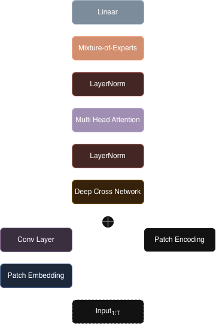

# Tana Forecast
A decoder only time-series foundation model designed to outperform current time-series SOTA models.

## Current Status



The model, which has 280 millions parameters, is being trained on diverse datasets spanning financial markets (S&P 500, stock prices, etc.), logistics (material demand, trade statistics, etc.), and natural events (weather patterns, natural disasters, etc.).
We chose a default 4096 data points context window and 256 data points prediction length.

The model is tested on ```fev-benchmark```.

## Citations
```bibtex
@article{shchur2025fev,
  title={{fev-bench}: A Realistic Benchmark for Time Series Forecasting},
  author={Shchur, Oleksandr and Ansari, Abdul Fatir and Turkmen, Caner and Stella, Lorenzo and Erickson, Nick and Guerron, Pablo and Bohlke-Schneider, Michael and Wang, Yuyang},
  year={2025},
  eprint={2509.26468},
  archivePrefix={arXiv},
  primaryClass={cs.LG}
}
```
